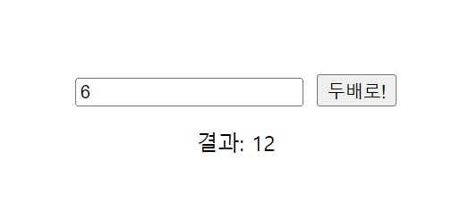
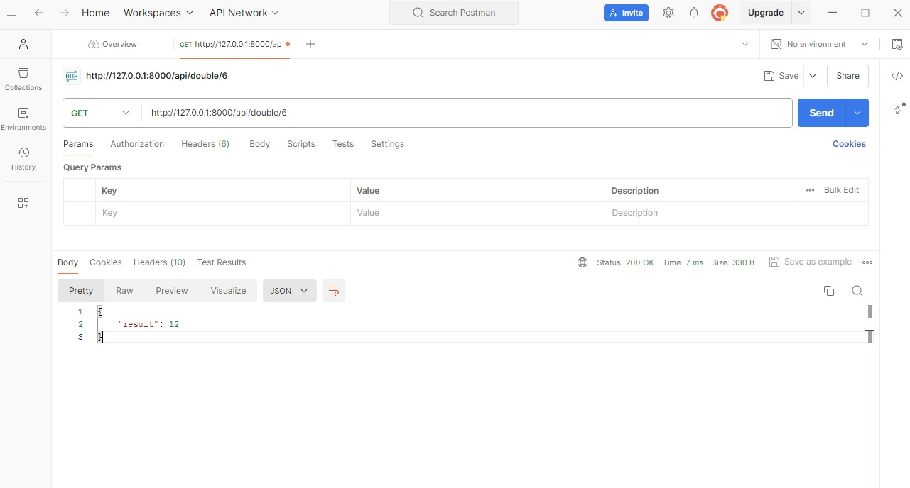

# 숫자 두배 계산기 프로젝트

Vue.js 프론트엔드와 Django 백엔드를 사용한 간단한 숫자 두배 계산기 프로젝트

## 기능

- 텍스트 박스에 숫자 입력
- 버튼 클릭 시 입력한 숫자의 2배 값 계산
- 백엔드 API를 통해 계산 수행
- 계산 결과 화면에 표시

## 스크린샷

## 사용 방법

1. 프로젝트 클론
2. 백엔드 설정
3. 프론트엔드 설정
4. 브라우저에서 `http://localhost:5173/` 접속
5. 숫자 입력 후 "두배로!" 버튼 클릭
6. 결과 확인

## API 테스트

Postman을 사용하여 API를 직접 테스트할 수 있음
- GET 요청: `http://localhost:8000/api/double/{number}/`
- 예: `http://localhost:8000/api/double/5/`
